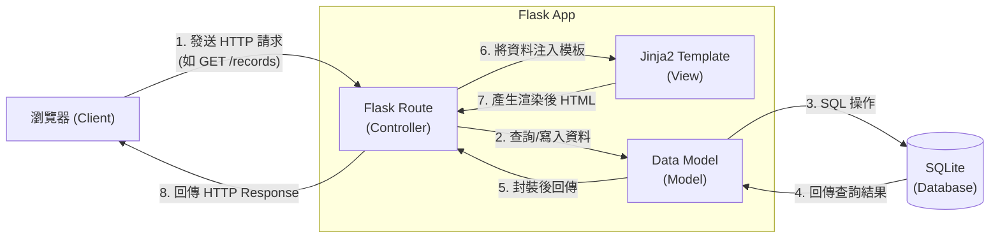

# 系統架構文件 (Architecture) - 個人記帳簿系統

本文件依據 PRD 所列的功能需求，定義專案的技術架構、資料夾結構與元件職責，作為開發階段的核心指引。

## 1. 技術架構說明

本系統採用經典的單體式 Web 架構，不區分前後端專案，直接由後端伺服器負擔頁面渲染。

### 選用技術與原因
- **後端框架：Python + Flask**
  - **原因**：Flask 是輕量化、具備高度擴充彈性的 Web 框架，十分適合快速開發個人或微型專案（如本記帳簿系統）。
- **模板引擎：Jinja2**
  - **原因**：Flask 內建支援的模板語言，能輕鬆在伺服器端將動態資料（如帳戶餘額、收支明細）注入至 HTML 中，免除撰寫複雜的前端框架（React/Vue 等）所需的上手與維護成本。
- **資料庫：SQLite (搭配 SQLAlchemy 或 sqlite3 原生套件)**
  - **原因**：零配置（Zero-configuration）且資料直接儲存於本地檔案，適合輕量存取、不需要跨伺服器部署資料庫的小型個人應用程式。

### Flask MVC 模式說明
在我們的架構中，採用類似 MVC (Model-View-Controller) 的設計模式：
- **Model (資料模型)**：負責定義資料表結構（如：User, Transaction, Account, Category, Budget）與資料庫互動邏輯，隔離了對 SQLite 的直接操作。
- **View (視圖)**：負責呈現使用者介面。在這裡主要由 `templates/` 下的 Jinja2 `.html` 檔案以及 `static/` 下的 CSS/JS 構成。
- **Controller (控制器)**：負責接收使用者請求（Request），在這裡對應於 Flask 的 `routes` 路由函數，收到請求後呼叫 Model 取得或更新資料，最後決定要渲染哪一張 View 呈現結果。

---

## 2. 專案資料夾結構

為了保持程式碼的可維護性，專案採用拆分職責的模組化結構，而非將所有程式碼塞入同一支檔案中。

```text
個人記帳簿系統/
├── app/
│   ├── __init__.py      ← 建立與初始化 Flask App 的地方
│   ├── models/          ← 資料庫模型 (Model)
│   │   ├── __init__.py
│   │   ├── account.py   ← 帳戶相關物件
│   │   ├── budget.py    ← 預算相關物件
│   │   └── record.py    ← 收支明細物件
│   ├── routes/          ← Flask 路由 (Controller)，建議以 Blueprint 切分
│   │   ├── __init__.py
│   │   ├── dashboard.py ← 首頁與 Dashboard 邏輯
│   │   └── records.py   ← 收支新增、編輯、刪除邏輯
│   ├── templates/       ← Jinja2 HTML 模板 (View)
│   │   ├── base.html    ← 共用版型 (Navbar, Footer 等)
│   │   ├── index.html   ← 首頁 (圖表、總覽)
│   │   └── records.html ← 收支明細列表與表單
│   └── static/          ← 靜態資源
│       ├── css/         ← 自訂的 CSS 樣式
│       ├── js/          ← 會用到的 JavaScript (如圖表繪製邏輯)
│       └── images/
├── instance/
│   └── database.db      ← SQLite 資料庫檔案 (需加入 .gitignore 避免上傳)
├── docs/                ← 專案文件 (包含 PRD, ARCHITECTURE 等)
├── config.py            ← 專案整體參數設定 (如資料庫路徑、密鑰等)
├── app.py               ← 應用程式啟動入口 (載入 app 模組並啟動伺服器)
└── requirements.txt     ← Python 第三方套件依賴清單
```

---

## 3. 元件關係圖

以下展示當使用者透過瀏覽器發送請求時，後端各個元件間的資料流向。



---

## 4. 關鍵設計決策

1. **捨棄前後端分離架構**
   - **原因**：本系統核心著重於收支的新增與資料展示。由於沒有極高互動性的複雜頁面，使用伺服器端渲染（SSR）配合基本的 Jinja2 可以大幅降低 MVP 階段的開發阻力，減少重複建立 API 與管理前端狀態的工時。
2. **採用 Blueprint 切分路由**
   - **原因**：將不同業務邏輯（如 Account, Transaction, Budget）的路由切分成不同的 Blueprint。能讓資料夾結構依賴業務領域而獨立運作，不僅解決 `app.py` 變得過於肥大的問題，也利於未來擴充功能。
3. **隔離 Instance 資料夾**
   - **原因**：SQLite 資料庫直接以實體檔案存在，將它（以及其他環境變數、敏感設定）獨立放置在 `instance/` 資料夾下，可以輕易透過 `.gitignore` 防止敏感資料不小心被 pushed 到 Git Repository 中。
4. **準備 JS 做圖表渲染**
   - **原因**：雖然主要頁面由 Jinja2 渲染，但為了滿足 PRD 中的「圖表統計分析（圓餅圖分析）」功能，仍會在 `static/js/` 加入前端製圖圖庫（如 Chart.js ），Jinja2 會先將數據轉換成 JSON 格式或是在腳本區塊中初始化變數，交由瀏覽器端繪製視覺圖表。
