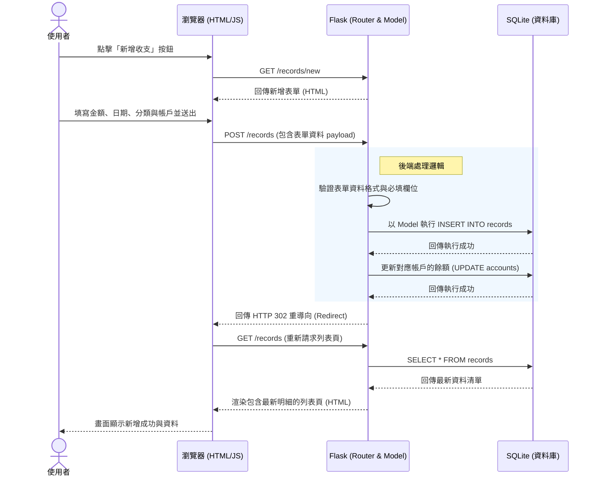

# 流程圖文件 (Flowchart) - 個人記帳簿系統

本文件基於產品需求文件 (PRD) 與系統架構文件 (ARCHITECTURE)，將使用者的操作路徑與系統內部的資料流繪製成視覺化圖表，便於開發與測試時對齊操作邏輯。

## 1. 使用者流程圖 (User Flow)

此流程圖展示了使用者進入個人記帳簿系統後，可以進行的各種操作路徑，涵蓋了管理收支、帳戶、分類與預算等主要功能。

```mermaid
flowchart LR
    Start([使用者開啟網頁]) --> Dashboard[Dashboard 首頁\n(顯示當月預算、圖表、近期明細)]
    
    Dashboard --> ActionRecord{操作收支明細?}
    ActionRecord -->|新增| FormRecord[填寫收支表單] 
    FormRecord --> SubmitRecord[送出儲存] --> Dashboard
    ActionRecord -->|查看| ListRecord[收支明細列表]
    ListRecord -->|篩選/搜尋| ListRecord
    ListRecord -->|編輯| EditRecord[修改收支表單] --> SubmitRecord
    ListRecord -->|刪除| DeleteRecord[確認刪除] --> ListRecord

    Dashboard --> ActionAccount{管理帳戶?}
    ActionAccount --> ListAccount[帳戶列表\n(顯示各帳戶餘額)]
    ListAccount -->|新增/編輯| FormAccount[帳戶設定表單] --> ListAccount

    Dashboard --> ActionBudget{設定預算?}
    ActionBudget --> FormBudget[填寫總預算與分類預算] --> Dashboard

    Dashboard --> ActionCategory{管理分類?}
    ActionCategory --> ListCategory[分類標籤清單]
    ListCategory -->|新增/編輯| FormCategory[填寫分類名稱] --> ListCategory
```

## 2. 系統序列圖 (Sequence Diagram)

此序列圖以「新增一筆收支明細」為例，展示了從使用者操作介面到後端與資料庫之間的完整互動流程。



## 3. 功能清單與路由對照表

開發時後端建立 Flask 路由 (Routes) 可參考以下對照表，所有資料修改皆透過標準 HTML 表單 POST 請求完成。

| 功能名稱 | 對應 URL 路徑 | HTTP 方法 | 功能說明 |
| :--- | :--- | :--- | :--- |
| **首頁總覽** | `/` | GET | 顯示目前餘額、當月花費圓餅圖與最新幾筆紀錄 |
| **收支列表** | `/records` | GET | 顯示所有或經過篩選的收支明細清單 |
| **新增收支** | `/records/new` | GET | 顯示新增收支明細的表單 |
| **儲存收支** | `/records` | POST | 接收新增表單資料並寫入資料庫 |
| **編輯收支** | `/records/<id>/edit` | GET | 顯示帶有原資料的修改表單 |
| **更新收支** | `/records/<id>/edit` | POST | 接收修改後的資料並更新資料庫 |
| **刪除收支** | `/records/<id>/delete`| POST | 執行刪除資料 (利用表單按鈕送出) |
| **管理帳戶** | `/accounts` | GET/POST | 顯示所有帳戶及各別餘額，並處理新增請求 |
| **設定預算** | `/budgets` | GET/POST | 顯示並處理當月總預算或分類預算的更新 |
| **管理分類** | `/categories` | GET/POST | 顯示並處理收支分類標籤的增刪改 |

> **提示**：由於 HTML `<form>` 本身僅支援 GET 或 POST，所以在刪除或更新資料的路由上，我們會採用 `POST` 來接收請求（而非 RESTful 標準中的 PUT/DELETE 方法）。這樣能最大化相容純 Jinja2 表單的實作方式。
